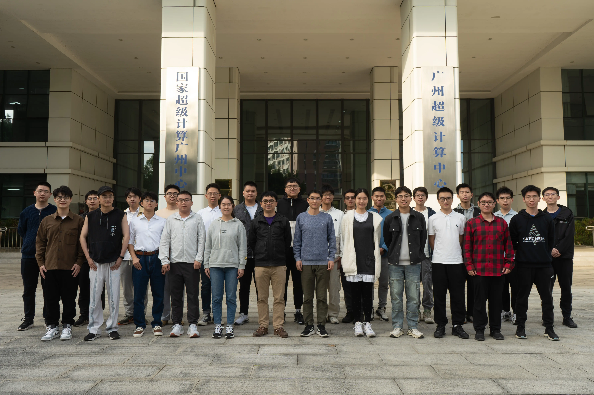
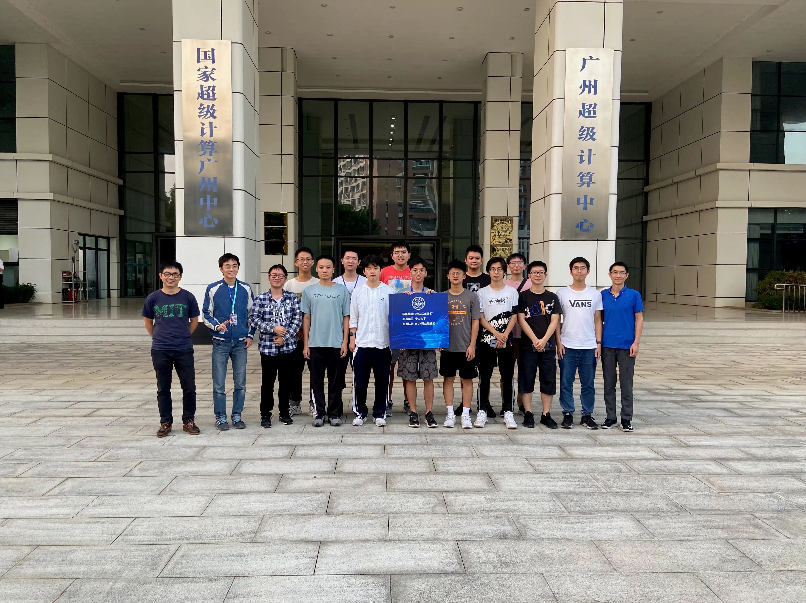
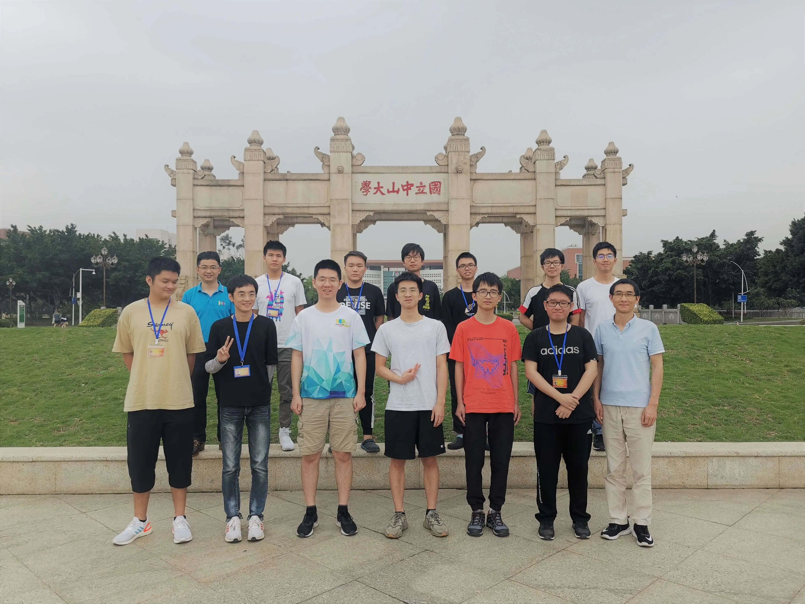

We are Student Cluster Competition Team at Sun Yat-sen University, and conduct research in the broad area of high performance computing and cluster systems.

## 2023

## 2021

## 2020

## Calendar

<iframe src="https://calendar.google.com/calendar/embed?height=600&wkst=1&bgcolor=%23ffffff&ctz=Asia%2FShanghai&showPrint=0&src=YThqZGQ1bTc1OGdnZTV2ZnFzcGVvMGVpMDhAZ3JvdXAuY2FsZW5kYXIuZ29vZ2xlLmNvbQ&color=%23F4511E&hl=en" style="border-width:0" width="800" height="600" frameborder="0" scrolling="no"></iframe>

Subscribe: [link](https://calendar.google.com/calendar/ical/a8jdd5m758gge5vfqspeo0ei08%40group.calendar.google.com/public/basic.ics) (copy this link and add it to your subscription on iOS or email calendar, do NOT download directly).
